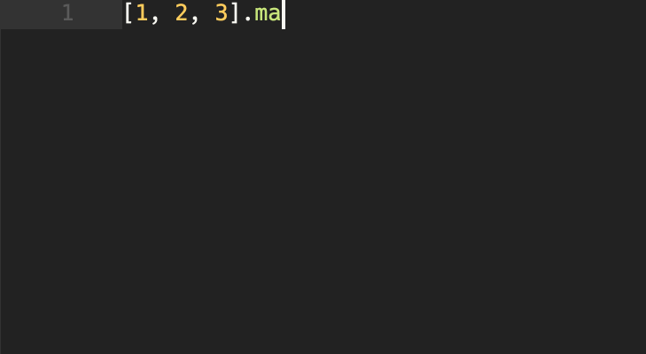

# vscode-endwise

This is an extension that wisely adds the "end" keyword to code structures in languages like Ruby or Crystal while keeping the correct indentation levels. Inspired by tpope's [endwise.vim](https://github.com/tpope/vim-endwise).



Enable VS Code's on-type formatting, then hit `enter` to get your block automagically closed:

```json
"editor.formatOnType": true
```

You can also enable it per language if you prefer language-specific editor settings.

`ctrl+enter` / `cmd+enter` closes from the middle of the line as well.

## TODO

- [X] Wisely detect already closed blocks to skip additional "end"'s
- [ ] Add support for more languages:
  - [x]  Crystal
  - [ ]  Lua
  - [ ]  Bash
  - [ ]  Elixir
- [ ] Add a gif with code that actually makes sense 🙄
